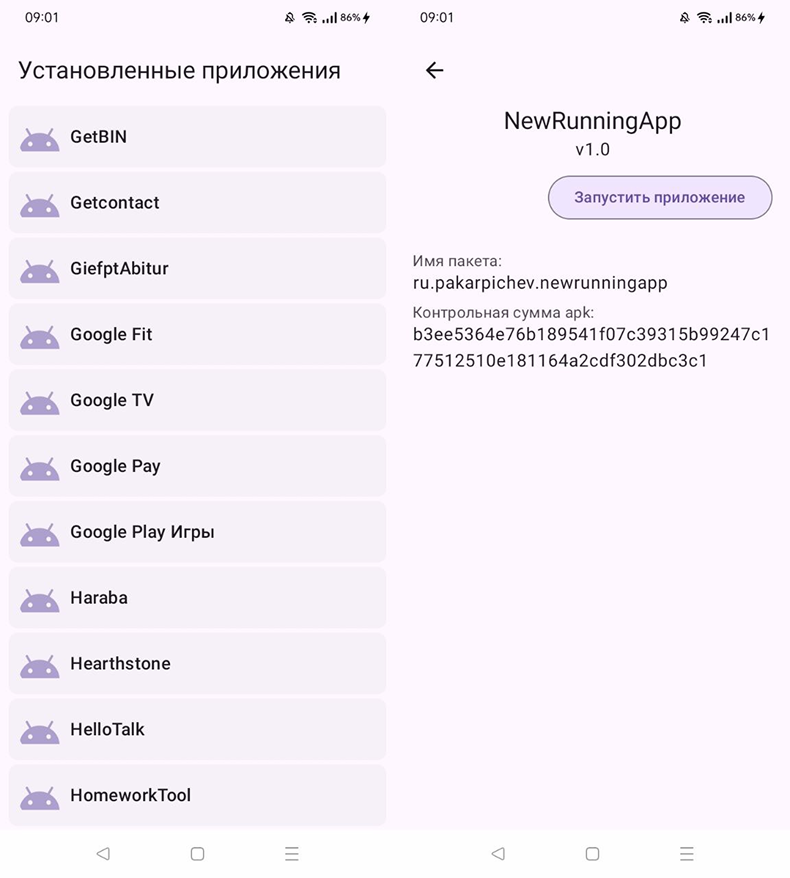

# TestForDrWeb

Это тестовое задание на должность Android-разработчик в DrWeb 

## Возможности  
- Приложение содержит экран со списком установленных приложений
- По нажатии на элемент списка переходит на экран с подробной информацией об установленном приложении
- На экране с информацией о приложении есть кнопка для запуска приложения  

## Технологии
Язык: Kotlin  
Архитектура: MVVM + MVI   
Асинхронные операции: Coroutines, Flow   
Внедрение зависимостей: Dagger Hilt  
UI: Jetpack Compose  
Навигация: Android navigation component(safe args)  
Алгоритм для вычисления контрольной суммы apk: SHA-256  
## Требования:
Android 7.0 (Nougat) или выше   
## Скриншоты  

